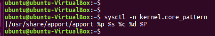

# From CVE-2020-15702 to another bug - CVE?

## Background Information

While trying to reproduce and work out a p0c for the CVE-2020-15702, I discovered the following weird behavior.
At the time of first discovery, I consider the following to potentially be a bug because it allows an information leak(process memory mapping) for a targeted priviledged process.


# CVE-2020-15702

CVE-2020-15702 is a vulnerability of type TOCTOU, which belongs to the family of race condition flaws. The weakness lies in the *apport* utility/package.

TOCTOU: Time Of Check, Time of Use

The *apport* utility function: *automatically generate crash reports for debugging(from https://ubuntu.com/security/notices/USN-4449-1)*

## CVE-2020-15702 - vulnerability characteristic

**Target:** In this writing we are concerned with the Ubuntu platform. Distros using the *apport* utility can be concerned.

**Type of vulnerability:** TOCTOU/race condition

**Local/remote:** local

**Potential:** local privilege escalation, code execution

**Mitigation:** update *apport* package, see Ubuntu security advisory.

# Weakness History

**From:**
https://lwn.net/Articles/830493/

direct **quote**:

*Ryota Shiga working with Trend Micro´s Zero Day Initiative, discovered that*
*Apport incorrectly dropped privileges when making certain D-Bus calls. A*
*local attacker could use this issue to read arbitrary files.(CVE-2020-11936)*

*Seong-Joong Kim discovered that Apport incorrectly parsed configuration*
*files. A local attacker could use this issue to cause Apport to crash,*
*resulting in a denial of service. (CVE-2020-15701)*

*Ryota Shiga working with Trend Micro´s Zero Day Initiative, discovered that*
*Apport incorrectly implemented certain checks. A local attacker could use*
*this issue to escalate privileges and run arbitrary code. (CVE-2020-15702)*


## Short Timeline

CVE-2020-15701 - Seong-Joong Kim, leads to:
=> CVE-2020-15702 - Ryota Shiga

Ryota Shiga(@Ga_ryo_) of Flatt Security, CVE-2020-15702 author.

# Approaching CVE-2020-15702

In this section, I lay down(more or less) the overall approach that I use to analyze this vulnerability.

0. lookup about this type of vulnerability i.e., toctou/race condition. I knew the high level concept of this type of vulnerability but never dealt with one.
1. OSINT around the vulnerability i.e., cve-2020-15702
2. Find out if there is any public poc
3. Try to reproduce/adapt/develop from scratch

# PoC - Shiga's

This section deals with the analysis of Shiga's blog post.

[Ryota Shiga cve-2020-15702 author](https://flattsecurity.hatenablog.com/entry/2020/09/30/130844)

References retrieved from his site:

**From:**
https://flattsecurity.hatenablog.com/entry/2020/09/30/130844

https://flattsecurity.medium.com/cve-2020-15702-race-condition-vulnerability-in-handling-of-pid-by-apport-4047f2e00a67

extracted references => 

https://git.launchpad.net/ubuntu/+source/apport/plain/data/apport?h=applied/ubuntu/focal-devel&id=02a1fd19eafeae3f8e98f1461c9bcea850f0c419

http://archive.ubuntu.com/ubuntu/pool/main/a/apport/apport_2.20.11-0ubuntu27.tar.gz

http://launchpadlibrarian.net/491870223/apport_2.20.11-0ubuntu27.4_2.20.11-0ubuntu27.6.diff.gz

## Following his steps

direct **quote**:

*All you need to know here is that the PID of the crashed process will be passed to apport.*

He lists some related bugs:

https://securitylab.github.com/research/ubuntu-apport-CVE-2019-15790

https://securitylab.github.com/research/ubuntu-apport-CVE-2019-7307

https://www.exploit-db.com/exploits/37088

**Important point:**

- A feature of *apport* that can be abused

DEVELOP THIS POINT

 *to save the coredump information sent from the kernel to the working directory where the process was running. By abusing this, we can write the coredump information of our own process as a core file to the cwd of the privileged process.*


`kernel.core_pattern` determines the action to be taken when a program crashes.
i.e. writing a *coredump* file.
*Apport* modifies the value of this parameter.

```bash
$ sysctl -n kernel.core_pattern
```



The command line of the process triggering the *coredump* is analyzed by
*Apport* to determine if it's a script.

%p :pid of dumped process

%s :signal number that caused the coredump

%c :soft rlimit of the coredump size

%d :

%P :pid of dumped process in the initial pid namespace

`sysctl` queries the pseudo file-system `procfs`.

## PoC - overview

He lists two main points in his writing:

1. adjust the PID recycling time
2. the way to escalate privileges when core file is saved to current working directory(cwd) of privileged process

Requirement to adjust the timing of PID recycling:

- send a SIGSEGV(code number 11) to launch *apport* 
- and duplicate the PID by sending SIGKILL(code number 9) and launching privileged process before reading of `procfs`. These steps need to be done in a constraint time frame.

Reproducing SIGSEGV behavior with *apport*:


Side note: signals were defined in Unix as one of the means to do inter-process communication.


In his demo(the GIF at the end of his blog post), he uses the following to apparently speed up the recycling process.

`# echo 65536 > /proc/sys/kernel/pid_max`

I say "apparently" because on an Ubuntu16.04, the number of available process identifiers is 32768:


=> What am I missing here? Need to check this deeper. Maybe the default value on an Ubuntu20.04 is different ; need to download an ISO to confirm or not.

Reference for `pid_max`: https://www.kernel.org/doc/Documentation/sysctl/kernel.txt

### Issues

In his post, he mentions some issues to get "the timing right" for the signals to be sent:

#### Issue concerning PID round:

*apport checks to see if another apport has already launched with a file called `/var/run/apport.lock` at startup*

To put the program on "hold", the *apport* utility first checks `/var/run/apport.lock` . We actually don't put anything purposely on hold, it's taking advantage of the locking feature of *apport*.

He chooses to use one of `dbus` functionality to put *apport* on "hold".

Looking for `dbus` related stuff, specifically `gdbus` utility:


Looking after the `dbus` environment variable he uses:


**Reproducing (g)dbus behavior:**

He uses in the following way(taken from his post):

```bash
$ DBUS_SESSION_BUS_ADDRESS='tcp:host=127.0.0.1,port=8888' gdbus call -e -d org.gnome.SessionManager
```

Getting a bit more info on `gdbus call`:


## His summary for stopping apport execution

Taken from his post:

```
1. set the env variable DBUS_SESSION_BUS_ADDRESS to a value like tcp: host = 127.0.0.1, port = 8888
2. launch the tcp server on the specified port
3. launch apport by sending sigsegv to process A
4. AUTH request comes from gdbus to TCP server, but stops it by not responding here.
5. launch apport by sending sigsegv to newly created process B
6. apport stops running at check_lock() function, because another process is not terminated.
7. send sigkill to process B
8. launch a privileged process in some way to duplicate the PID of process B
9. send some random response from TCP server to resume execution
10. apport for process A terminates
11. the lock is released and the apport execution for process B resumes(at this point the PID of process B is being recycled)
```

We almost got every element, point number 8 remains to be explored.

## Privilege escalation when coredump is saved to current working directory

Taken from his blog post:

```
1. basically always executed at a specific time(timing can be predicted)
2. basically run with high privileges
3. call chdir() before reading files in /etc/logrotate.d/
4. It doesn't depend on file name. (read all files in that dir)
5. Since the file format is not strictly checked and invalid characters are skipped, it is sufficient if the abnormal binary file contains a string of normal configuration.
```

The use of `logrotate` is motivated by the fact that it makes a call to `chdir()`.

### Payload used to create /tmp/exploited

```bash
char payload[] = "\n/tmp/pwn.log{\n    su root root\n    daily\n    size=0\n    firstaction\n        touch /tmp/exploited;\n    endscript\n}\n";
```

Which will be parsed by `logrotate`.

## Going through the steps from his demo/illustration(GIF)

From GIF:

He creates 4 files of size ~ 4Mb to slow down the parsing process by `logrotate`:

On the uid(0) shell:

```bash
dd if=/dev/zero of=/etc/logrotate.d/garbage.1 bs=1024 count=4096
dd if=/dev/zero of=/etc/logrotate.d/garbage.2 bs=1024 count=4096
dd if=/dev/zero of=/etc/logrotate.d/garbage.3 bs=1024 count=4096
dd if=/dev/zero of=/etc/logrotate.d/garbage.4 bs=1024 count=4096
```

Changes the `pid_max` value:

```bash
echo 65536 > /proc/sys/kernel/pid_max # saving time
```

Up until this point, he doesn't launch his script(`./x`) that will initiate the "whole stuff".

Proper execution starts from here(on this shell instance):

The following line will only be launched when the script(`./x`) **finishes**.

```bash
logrotate -f /etc/logrotate.d/
```

The following file is created:

```bash
/tmp/exploited
```

On a regular user shell, he runs the `./x`:

```bash
$ ./x
rm: cannot remove '/tmp/pwn.log*': No such file or directory
Listen start
Sync msg sent
Target pid is 4651
Start crashing to spawn apport
Send SEGV
Successfully accepted connection from apport
Now we won't close this connection cuz we want to keep locking
/var/run/apport.lock!!
getting pid 4911
current pid = 4643..
```


# PoC - adaptation

check python script

## What's already out there about CVE-2020-15702?

At the time of this writing i.e., 2020-12-17, the relevant information in direct concern with the exploitation of this vulnerability was Shiga's post about his discovery(see below).

My approach is solely based and inspired by Shiga's blog post:

[Ryota Shiga cve-2020-15702 author]([https://flattsecurity.hatenablog.com/entry/2020/09/30/130844](https://flattsecurity.medium.com/cve-2020-15702-race-condition-vulnerability-in-handling-of-pid-by-apport-4047f2e00a67))

After a careful analysis of his approach, in a first time, my goal is to try to reproduce it.

## Building Blocks - what's needed

By analyzing Shiga's poc we can identify and, to a certain extent have to make some inferences in regards to the elements used to build the poc:

- a component that can that makes a call to `chdir()`

- a way to detect a file spawing in a directory --> inotify

  

## Testing on target - technical details

Preliminary tests have been conducted on an Ubuntu16.04 i386 desktop:


## Going step by step:

**State 0:** set up environmental variable `DBUS_SESSION_BUS_ADDRESS`:


**State 1:** calling a dbus object and launching a TCP server:


**State 2:** sending signal 11(SIGSEGV) on gdbus pid(8860).


**State 3:** sending signal 11(SIGSEGV) on gdbus duplicate pid(9256)


**State 4:** observing the lock on *apport* when sending 11 on the first time:


**State 5:** freeing *apport* lock when sensing signal 9:


## Encountered issues

IN PROGRESS

Difficulty to handle process communication through python ; not as straightforward as in bash.

# Script to lookup the *apport* version

Based on the information available at:

https://ubuntu.com/security/CVE-2020-15702

This bash script retrieves the local version of *apport*. If the version differs from the version listed in the link above ; so far, tested on ubuntu16.04.

At this point, there is no fancy version checking ; this script is also out of scope.

Current state of the script:

```bash
#!/bin/bash

# ubuntu.com/security/CVE-2020-15702
# accessed 2020-12-17
ubuntuVersions=(14.04 16.04 18.04 20.04 20.10)
localVersion=`egrep 'VERSION_ID=' /etc/os-release | sed -r 's/.*=//g' | tr -d '"'` 

# updated apport ubuntu versions
apportUbuntu1604="2.20.1-0ubuntu.2.24"

echo [+] Ubuntu check for CVE-2020-15702

for i in "${ubuntuVersions[@]}"
do
    if [ "$i" == "$localVersion" ] ; then
        echo [+] Host: $HOSTNAME is version "$i"
    fi
done

if [[ "$localVersion" == "14.04" ]] ; then
    echo "Still to be done"
elif [[ "$localVersion" == "16.04" ]] ; then
    apportVersion=`dpkg-query -W apport | cut -f2`
    echo [+] Apport version: "$apportVersion"
    if [[ "$apportVersion" != "$apportUbuntu1604" ]] ; then
    echo [+] Patched version is: $apportUbuntu1604
    echo [+] The local apport version might be vulnerable!
    fi
    # still missing the other cases
fi

```


# Conclusion

Once again, Shiga's blog post about his discovery was a crux in the understanding of the bug.

Here is some sort of a flow diagram about the bug:


Even though I managed to get all the pieces together, I am still missing the ability to get the payload executed. My analysis lead me to the following (potential) bug:


## Other Considerations

TOCTOU/race condition type of bugs can be an interesting exploration path. Speaking in terms vulnerability discovery  because hardening techniques are getting stronger,
logic bugs and race condition bugs can be a powerful approach/direction.
It makes me think about the "type confusion" category of bugs in the js language.

other thing about tracing

# References

This section contains list of consulted references:

https://ubuntu.com/security/CVE-2020-15702

https://www.ubuntuupdates.org/package/core/bionic/main/security/apport

https://launchpad.net/bugs/cve/CVE-2020-15702

https://ubuntu.com/security/notices/USN-4449-1

https://packetstormsecurity.com/files/cve/CVE-2020-15702

https://vuldb.com/?id.159349

https://cxsecurity.com/cveshow/CVE-2020-15702/

https://www.zerodayinitiative.com/advisories/ZDI-20-979/

https://lwn.net/Articles/830493/


**Related vulnerabilities(non exhaustive list):**

[ApportKernelCrashdumpFileAccessVulnerabilities](https://www.halfdog.net/Security/2015/ApportKernelCrashdumpFileAccessVulnerabilities/)

[Tavis Ormandy - cve-2015-1318, cve-2015-1862](https://www.openwall.com/lists/oss-security/2015/04/14/4)

Found MISC magazine 83(this is in French), writing about an *apport* vulnerability 2015.

https://boutique.ed-diamond.com/numeros-deja-parus/921-misc83.html


